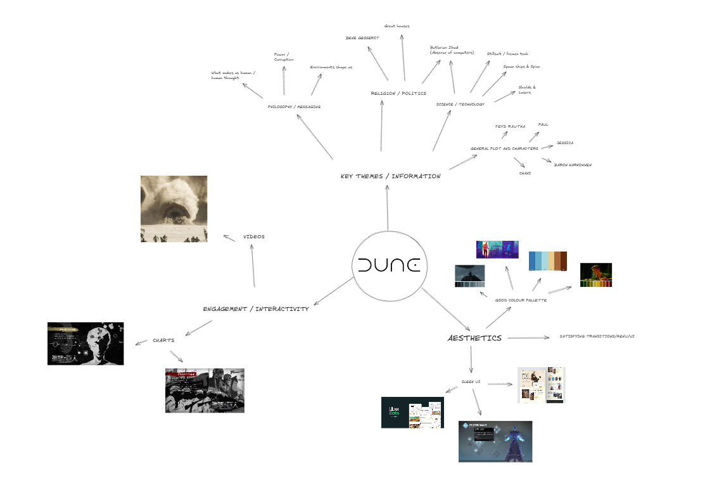

# **Assessment Task 1  - UX Design**
### **By Luca Pritchard**
--- 
# **Design brief**
I want to create an interactive website with videos, charts, excerpts from the book and all things related to the dune universe. It will be semi-based off of the appendix of the book which shows things like the religions from Dune and the made up words used in the book. My target audience is someone similar to me who is interested in anything about dune whether it's the characters, ecology, religion, philosophy, etc. 
Book Choice and justification
## **Identify the name of the book and author**
Dune - By Frank Herbert 
## **Summarise what the book is about**
Dune, set roughly 20,000 years in the future in a vast futuristic empire,  follows a young boy named Paul; who is the heir of house Atreides, one of the 4 royal houses of the “Landsraad.” The planet Arrakis, nicknamed ‘Dune’ is the most important planet in the universe because it's the only source of ‘Melange’ or the spice. The spice allows for space travel, makes you smarter and lives longer (and smells like cinnamon.) The Emperor is upset with house atreides for gaining too much power so he gives them control of Arrakis in an elaborate plot to defeat them.
## **Explain why you chose this book**
One thing I particularly enjoy about dune is how in depth the Author frank herbert went into fleshing out all aspects of the world, the ecology and science, the politics, the history, the religion, etc. I also like the themes/ideas the book explores eg. how environments impact us, human psychology & thought, power & suffering. Finally I just like the main character and enjoy his journey throughout the book
# **User Experience Type** 
## **Identify what format your project will take**
I’m aiming for my project to be a website created using Figma, however it will be extremely interactive and contain videos, graphs, etc. 
It would look kind of similar to the “current publicly disclosable information” from attack on titan
## **Explain how this format will enhance the story or themes of the book**
By creating an interactive website with videos and graphs, I aim to provide the information from a wikipedia or encyclopedia while maintaining the enjoyableness and engagement of a game or youtube video. 

# **Target audience**
## **Identify the intended audience (Age group, interests, reading level, etc.)**
People of any age who are interested in either Dune, psychology, philosophy, science, language, etc. I think it would be very difficult to appeal to someone who has no interest in dune / hasn’t watched or read it. 
## **Explain why this project will appeal to them**
Because they will get access to an extremely detailed analysis about a book they are interested in a fun and engaging way. It will be more informative and in-depth than other sources while also aiming to be engaging with good aesthetics and charts / games
##  **Explain how your design choices will cater to this audience**
By creating a very sleek looking, easy to navigate and appealing menu, users are more likely to engage with my product. Also, by having charts / interactive features the user will get a richer understanding of the science and technology behind dune.
# **Software And tools**
## **List the software, platforms, and tools you plan to use**
I plan to use Figma to design the website prototype and interactive features and I will also be creating graphics and designs in procreate. Finally when putting videos in my website I will be using Premiere Rush
## **Explain why each of the above are suitable for your project**
Figma - Since figma is free with education accounts and offers hundreds of pre-made templates for designs such as buttons, charts and various other UI features. 
Procreate - I prefer procreate over other software because I have a lot of experience using it before and I already have a lot of pre-downloaded brush sets I've found over time. Also I like the UI and find it easy to use.
Premiere Rush - Rush has been my go to for making any video / movie project for school over the past 3 years. It’s easy for me to navigate through and is made to be very convenient with transitions and what not. 

# **Initial Brainstorming**

https://excalidraw.com/#json=H6QUWR0z4paJ0JeTJX4_X,JCtq_dhARo_ia284iwyfDg
## **Evaluate each branch by considering its feasibility, impact, and effectiveness**
### **Aesthetics -**
 Through the aid of programs like figma and procreate, I believe it to be entirely feasible for me to complete this branch, things like colour palettes and such will be fairly easy to complete and are crucial in making the viewer enjoy the website.
### **Key Themes / Information -**
 As you may expect, without the key themes and information from dune I cannot deliver on my project's purpose and create an enjoyable learning resource. It will be the easiest and simplest to complete but it may be time consuming transferring information from other sources to my website.
### **Engagement / interactivity -**
#### this will most likely be the hardest part of the project to realise as creating fully fledged videos / charts of a high standard will be difficult. Despite this I think I can still do it with the aid of programs such as premiere Rush.
--- 

# **Requirements Specification**
## **Functional Requirements**

### **Purpose of the Application**
The app aims to engage people previously interested in the Dune franchise by captivating them with interactive and in-depth informative material within the universe of Dune. I don't intend to appeal to those who haven't read the books or watched the movie. 
### **Use Cases** 
- Users will be able to gain a more indepth understanding of graphs/charts through pop-up menus 
- Via zooming in charts, users can grasp the full scale of dune regarding the animals and technology
- There will be a libary where you can manually drag to see all the different factions of dune
- Users can opt to go to a more detailed version of the factions and got to a seperate page 

### **Test Cases** 
- When hovering over graphs regarding Dune technology, extra information will pop up, eg. if they hover over a stillsuit diagram, each section of the suit will have extra information detailing its purpose. 
- You will be able to zoom in and out on a large chart describing the size of the animals and ships in Dune.
- There will be a library esque menu where you can click and drag to see the different factions of dune. 
- When you click on these factions / groups eg. the Bene gesserit; you will be taken to another page which has more information reguarding the given faction. 

### I will test these features by first using them myself and then getting friends to revise them and make sure they work. 
----- 
## **Non-Functional Requirements** 
- ## Performance 
    - Ideally, my website will have no noticable delay between any mouse inputs and their corresponding actions. Their may be some delay whenloading a new page due to the images / graphs / text, however this shouldn't take more than a few seconds. 
- ## Usability 
    - I am aiming to have an extremely simple and logical way of navigating my website. I despise apps which are clunky and full of things you don't need that are hard to navigate, mine will be simple and easy to navigate. 
- ## Reliability
    - I will do a considerable amount of testing by myself and with friends to definitively state that my site is bug free, in addition to this screen size shouldn't be an issue since Figma is built to support different devices and screen sizes. 
- ## Security 
    - I don't intend to advertise any other services and also the user doesn't need to save their progress so there will be no log in details or anything saved, however I will provide a google form for feedback about the website. 
----
# **Social, Legal and Ethical Issues**
- ## Target Audience Considerations 
All users of my site will be people of varying age and life circumstances, the only common thing they will share is that they have an interest in the Dune book series. Due to this fact I will try make my site accomodating to neurodivergent people such as people with A.D.H.D. I will do this by making my website particularly engaging, colourful and easy to navigate. 
- ## Potential Benefits
Obviously since dune is a book series, this site is likely to foster an interest in reading, particularly in science fiction books. However this my website may also result in a viewer developing a hobbie related to science, technology or environments and biology. Finally, my site will benefit consumers by informing them on the book series they were previously interested in and answering their questions. 
- ## Potential Risks 
I can only thing of two ways where my site could be harmful. 
1. Since Dune takes a lot of inspiration from Saudi Arabian and middle eastern communities, some middle eastern people may take offense.
2. The Dune books as they were made over 50 years ago do somewhat misrepresent women or relegate them to minor roles, this is exemplified in Chani, Pauls love interest; Paul gets a wife while still dating Chani and then starts a war and Chani thinks nothing of it and just agrees with her husband. 
In an effort to counterract this messaging, I will add disclaimers and also will leave out some of the parts which I see as more harmful or stereotypical.

## **Ethical Responsibilities**
### User Data & Privacy
My site will collect no user data aside from anything they send in the suggestions form and thus I have no ethical requirements to meet when reguarding their privacy. 

### Representation & Inclusion
As mentioned previously there are some instances where women are relegated to smaller roles or seem to not think for themeselves and leave the decisions to their male counterparts. I intend to focus on the more empowering parts of the book and leave disclaimers and notes where I believe women or middle eastern communities are being poorly represented. 

### Content Sensitivity
The book does contain frequent encounters with murder, sex and violence, Which I will largely exclude this content and won't contain and graphic descriptions. However there will be some instances where I will need to say things like "X-Character killed Y-Charcter" and such for informative purposes. 

## **Legal Considerations** 
### Copyright & Intellectual Property:
I will largely be creating my own resources through descriptions, drawings, graphs, etc. When I do use a quote from the book or an image online, I will make sure to site its creator so it is legally allowed under fair use. 

### Terms of Use
If I were to launch my website, It would be allowed as long as It was profit free and I site my sources eg. Dune by frank Herbert or any artists who made images I used. Since I plan to do both of these things, It is fair use. 

--- 
# **Researching and Planning** 
